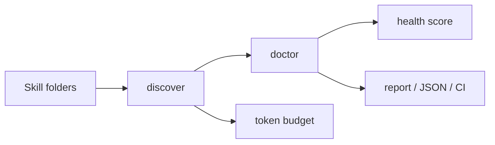

<p align="center">
  <a href="./README.md">English</a> ·
  <a href="./README.zh-CN.md">简体中文</a> ·
  <a href="./README.zh-TW.md">繁體中文</a> ·
  <a href="./README.ja.md">日本語</a> ·
  <a href="./README.ko.md">한국어</a> ·
  <a href="./README.es.md">Español</a> ·
  <a href="./README.fr.md">Français</a> ·
  <a href="./README.de.md">Deutsch</a> ·
  <a href="./README.pt-BR.md">Português</a> ·
  <a href="./README.ru.md">Русский</a>
</p>

<p align="center">
  
</p>

<h1 align="center">skillint</h1>

<p align="center"><b>eslint for <code>SKILL.md</code></b></p>

<p align="center">
  Audit <code>SKILL.md</code>, <code>AGENTS.md</code>, and editor rules used by
  <b>Codex</b>, <b>Cursor</b>, <b>Claude Code</b>, <b>Grok</b>, <b>Gemini</b>, <b>Copilot</b>, and other agents.
  Find duplicates, missing metadata, and context bloat before they land in the prompt.
</p>

<p align="center">
  <a href="https://github.com/iosrxwy/skillint/actions/workflows/ci.yml"></a>
  <a href="./LICENSE"></a>
  <a href="https://github.com/iosrxwy/skillint/issues"></a>
  <a href="https://github.com/iosrxwy/skillint/stargazers"></a>
</p>

<p align="center">
  
</p>

---

## Why this exists

Coding agents no longer read one system prompt. They load a catalog of skills on demand.

That catalog only works when it is **small, named, and described**. A workstation that copied hundreds of skills will:

- spend thousands of tokens on metadata before any real work starts
- hide the useful skill behind three near-identical copies
- inject 10k-token bodies into a single turn
- fail silently when `description` is missing, so the skill never gets selected

<p align="center">
  
</p>

`skillint` is the linter for that folder. It does not execute skills. It does not delete files. It reports what an agent would have to carry.

## Features

- **Inventory** — discover skills and rules across Codex, Cursor, Claude Code, Grok, Gemini, Copilot, and project roots
- **Health score** — 0–100 catalog score from doctor findings and catalog size
- **Token budget** — estimate metadata cost vs full-body cost (`characters / 4`)
- **Doctor** — duplicates, missing/short/first-person descriptions, oversized files, long AGENTS.md; copies across Cursor/Claude/Grok are info, not errors
- **Prune plan** — ranked keep/drop suggestions; never mutates the filesystem
- **Markdown report** — CI-friendly artifact for pull requests and maintainer review
- **GitHub Action** — `uses: iosrxwy/skillint@main` on any public repo
- **JSON output** — every command supports `--json`

## Install

Requires Node.js 18.18 or later.

```bash
git clone https://github.com/iosrxwy/skillint.git
cd skillint
npm install
npx skillint scan
```

`npm install` builds the CLI. After that, `npx skillint` works in the repo, or `npm link` puts `skillint` on your PATH.

## Quick start

```bash
skillint scan                 # inventory + token budget + health bar
skillint doctor               # diagnostics
skillint init code-review     # scaffold a SKILL.md that passes doctor
skillint tokens               # compact numbers
skillint prune --keep 12      # suggestions only
skillint report --out out.md  # markdown audit
```

Scope control:

```bash
skillint scan -g              # user-level dirs only
skillint scan -p              # current project only
skillint doctor ./skills      # one directory
skillint doctor --json --fail-on error
skillint doctor --fail-under 80   # fail CI when health drops below 80
```

`prune` and `report` are read-only. skillint never deletes a skill file.

## Example

From a developer machine with a large local skill library:

<p align="center">
  
</p>

`skillint doctor` on the same machine: **233 findings** (60 duplicate names, 152 oversized files, 20 missing descriptions).

An agent does not need three million tokens of skills.

## What it scans

| Agent | Global | Project |
| --- | --- | --- |
| Cursor | `~/.cursor/skills`, `~/.cursor/rules` | `.cursor/skills`, `.cursor/rules` |
| Claude Code | `~/.claude/skills`, `~/.claude/rules` | `.claude/skills`, `.claude/rules` |
| Codex | `~/.codex/skills`, `~/.codex/rules`, `~/.codex/prompts` | `.codex/skills`, `.codex/rules`, `.codex/prompts` |
| Grok | `~/.grok/skills`, `~/.grok/plugins` | `.grok/skills`, `.grok/plugins` |
| Gemini / Antigravity | `~/.gemini/skills`, `~/.antigravity/skills` | `.gemini/skills`, `.antigravity/skills` |
| GitHub Copilot | `~/.copilot/skills` | `.github/skills`, `.github/agents`, `.github/instructions` |
| OpenCode | `~/.config/opencode/skills` | `.opencode/skills` |
| Windsurf | `~/.codeium/windsurf/skills`, `~/.windsurf/skills` | `.windsurf/skills` |
| Kiro | `~/.kiro/skills`, `~/.kiro/steering` | `.kiro/skills`, `.kiro/steering` |
| Cline / Continue | `~/.cline/skills`, `~/.continue/skills` | `.cline/skills`, `.continue/skills` |
| Shared agents | `~/.agents/skills` | `.agents/skills`, `skills/` |
| Others | Factory, OpenClaw, Hermes, Qoder, CodeBuddy, Goose, Amp, Roo, Trae, Crush, Pi, cc-switch | matching `.tool/skills` folders |

Also reads project instruction files: `AGENTS.md`, `AGENT.md`, `CLAUDE.md`, `GEMINI.md`, `GROK.md`, `CODEX.md`, `COPILOT.md`, `WINDSURF.md`, `OPENCODE.md`, `.cursorrules`, `.windsurfrules`, `.clinerules`, `.github/copilot-instructions.md`.

Token counts are **estimates**, not a vendor tokenizer. Use them to compare size, not to bill APIs.

## GitHub Action

```yaml
name: skillint
on: [push, pull_request]
jobs:
  audit:
    runs-on: ubuntu-latest
    steps:
      - uses: actions/checkout@v4
      - uses: iosrxwy/skillint@main
        with:
          fail-on: error
```

Findings show up as pull request annotations. Copies of the same skill across Cursor, Claude, Grok, and other agents are reported as info (`synced-copy`), not as CI-failing duplicates.

## Ignore patterns

Create `.skillintignore` in the working directory, or pass `--ignore`:

```bash
skillint doctor --ignore vendor --ignore "*.bak"
```

## Configuration

Put a `skillint.config.json` next to where you run skillint to share ignore patterns and tune the doctor limits:

```json
{
  "ignore": ["vendor", "*.bak"],
  "limits": {
    "skillBodyTokens": 3000,
    "descriptionMin": 60
  }
}
```

Available limits: `skillBodyTokens` (4000), `ruleAlwaysOnTokens` (800), `descriptionMax` (1024), `descriptionMin` (40), `agentsDocLines` (100), `nameMax` (64).

## How it works



skillint only reads files. It never executes a skill and never deletes one.

## CI

```yaml
- run: node dist/cli.js doctor ./skills --fail-on error
- run: node dist/cli.js report --out skillint-report.md -p
```

This repository dogfoods `doctor` on `./skills` in GitHub Actions.

## Use it as an agent skill

The repo ships `skills/skillint/SKILL.md`:

```bash
npx skills add iosrxwy/skillint
```

## Development

```bash
npm test
npm run build
node dist/cli.js --help
```

## License

[MIT](./LICENSE) © 2026 [iosrxwy](https://github.com/iosrxwy)
