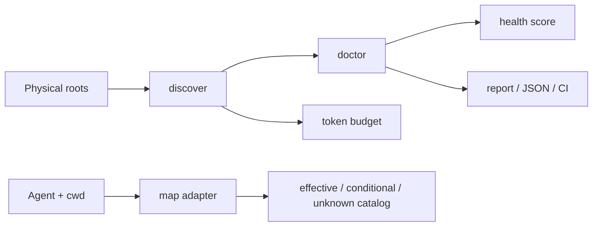

<p align="center">
  <a href="./README.md">English</a> ·
  <a href="./README.zh-CN.md">简体中文</a> ·
  <a href="./README.zh-TW.md">繁體中文</a> ·
  <a href="./README.ja.md">日本語</a> ·
  <a href="./README.ko.md">한국어</a> ·
  <a href="./README.es.md">Español</a> ·
  <a href="./README.fr.md">Français</a> ·
  <a href="./README.de.md">Deutsch</a> ·
  <a href="./README.pt-BR.md">Português</a> ·
  <a href="./README.ru.md">Русский</a>
</p>

<p align="center">
  
</p>

<h1 align="center">skillint</h1>

<p align="center"><b>eslint for <code>SKILL.md</code></b></p>

<p align="center">
  Audit <code>SKILL.md</code>, <code>AGENTS.md</code>, and editor rules used by
  <b>Codex</b>, <b>Cursor</b>, <b>Claude Code</b>, <b>Grok</b>, <b>Gemini</b>, <b>Copilot</b>, and other agents.
  Separate copied installs from real conflicts, diagnose broken metadata, and estimate catalog size before it becomes agent context.
</p>

<p align="center">
  <a href="https://github.com/iosrxwy/skillint/actions/workflows/ci.yml"></a>
  <a href="https://www.npmjs.com/package/skillint"></a>
  <a href="./LICENSE"></a>
  <a href="https://github.com/iosrxwy/skillint/issues"></a>
  <a href="https://github.com/iosrxwy/skillint/stargazers"></a>
</p>

<p align="center">
  
</p>

```bash
npx skillint
```

This runs the default cross-agent physical inventory. The audit path is static and read-only: scanned skills are parsed as text and never executed. `scan`, `map`, `doctor`, `tokens`, and `prune` do not modify the catalog. `link --apply` and `update --apply` are explicit manager writes.

## What it solves

- **Catalog sprawl** — inventory global and project skills and rules across Codex, Cursor, Claude Code, Grok, Gemini, Copilot, OpenCode, Windsurf, Kiro, Cline, and more
- **Agent-specific resolution** — map Cursor, Claude Code, or Codex resources as effective, coexisting, shadowed, conditional, or unknown using each agent's documented discovery semantics
- **Duplicate noise** — report cross-agent installs as `synced-copy` info while keeping same-agent-family name collisions as errors
- **Broken skill specs** — diagnose missing, unclosed, or invalid YAML frontmatter; required fields; naming issues; oversized bodies; and long instruction files
- **Skill supply chain** — audit installed skills for `curl | bash`, leaked tokens, prompt-injection wording, permission bypass flags, and destructive commands, with file:line output
- **Unknown context size** — compare metadata and body size using explicit estimates (`characters / 4`), not exact tokenizer cost or a claim about what any model loaded
- **CI drift** — emit GitHub Action annotations and summaries, write Markdown/JSON reports, and enforce `--fail-on`, `--fail-under`, or shared config thresholds
- **Fast local scan** — use concurrent, bounded reads, follow symlinked skill roots without loops, and scaffold a valid starter with `skillint init`

---

## Why this exists

Coding agents can discover instructions from many global and project directories. Once those directories accumulate copies, the catalog becomes hard to reason about:

- the same skill copied across several agents makes inventory noisy
- duplicate names inside one agent family create real ambiguity
- malformed or missing metadata makes skill discovery unreliable
- oversized bodies and always-on rules hide potential context cost

<p align="center">
  
</p>

`skillint` turns those directories into an actionable audit: inventory, diagnostics, a 0–100 health score, estimated size, and an undoable cleanup plan. It never deletes files — cleanup means quarantine plus `skillint restore`.

## Install

Requires Node.js 22.12 or later.

```bash
npx skillint scan
```

No global install is required. To keep the command on your PATH:

```bash
npm install --global skillint
skillint scan
```

## Quick start

```bash
npx skillint scan                 # inventory + estimated size + health bar
npx skillint map --agent cursor   # Cursor's catalog for this directory
npx skillint doctor               # diagnostics
npx skillint audit                # security scan: curl|bash, leaked keys, injection
npx skillint ui                   # interactive terminal UI over everything
npx skillint init code-review     # scaffold a SKILL.md that passes doctor
npx skillint tokens               # compact estimates
npx skillint prune                # cleanup plan (safe items -> undoable trash)
npx skillint prune --apply        # move all safe items to ~/.skillint/trash
npx skillint restore              # undo the last trash batch
npx skillint link                 # share identical copies across agents
npx skillint update               # check git-backed skills for upstream updates
npx skillint report --out out.md  # Markdown audit
```

Scope control:

```bash
npx skillint scan -g              # user-level dirs only
npx skillint scan -p              # current project only
npx skillint doctor ./skills      # one directory
npx skillint doctor --json --fail-on error
npx skillint doctor --fail-under 80   # fail CI when health drops below 80
```

Audit commands never mutate or delete scanned skill files. `report` creates only the requested report, and `init` never overwrites an existing `SKILL.md`. `prune --apply`, `trash`, `restore`, `link --apply`, and `update --apply` are explicit write operations.

## Cleanup — no `rm`, ever

skillint never deletes anything. Cleanup moves items into a quarantine at `~/.skillint/trash/<timestamp>/` with a manifest, and `skillint restore` moves the last batch back:

```bash
npx skillint prune -g            # plan: what to trash and why
npx skillint prune -g --apply    # move all safe items to the trash
npx skillint restore             # changed your mind? undo the batch
npx skillint trash <path...>     # trash specific items by hand
```

| Bucket | Meaning |
| --- | --- |
| **safe** | Backups, nested copies, same-catalog duplicates. Trashed by `--apply`. |
| **review** | Oversized or broken metadata. Trim or fix; never touched by `--apply`. |

`prune` only targets junk inside one catalog. It does **not** touch the same skill installed across Cursor, Claude, Codex, and Grok — each agent reads its own directory; share those with `skillint link` instead.

## Interactive UI

`skillint ui` puts the whole engine behind a lazygit-style terminal UI — no flags to remember:

```bash
npx skillint ui -g
```

Five tabs with live counts: **issues** (doctor findings), **audit** (security scan), **cleanup** (prune plan), **links** (cross-agent sharing), **largest** (token hogs). Navigate with `1-5` and `j`/`k`, press `c` to copy the suggested command for the selected row, `r` to rescan, `q` to quit. The UI is read-only and needs no extra dependencies — commands are copied to your clipboard, never executed.

## Security audit

Skills are markdown you installed from the internet, and agents follow them. `audit` scans every installed skill for dangerous patterns — before an agent acts on one:

```bash
npx skillint audit -g
npx skillint audit --fail-on error   # gate CI
```

| Rule | Flags |
| --- | --- |
| `remote-exec` | `curl \| bash`, `irm \| iex` install pipes |
| `credential` | AWS/GitHub/Stripe/Slack/OpenAI token formats, private key blocks |
| `prompt-injection` | "ignore previous instructions", "hide this from the user" |
| `exfiltration` | instructions to send secrets or env data to a URL |
| `permission-bypass` | `--dangerously-skip-permissions`, `--yolo`, `--no-sandbox` |
| `sensitive-file` | `~/.ssh`, `.aws/credentials`, keychain reads |
| `destructive` | `rm -rf ~`, fork bombs |

Documentation placeholders (`sk-xxxx…`, `AKIA…EXAMPLE`) are filtered out. Findings include `path:line` and the matching excerpt; in GitHub Actions they surface as line-level annotations. The scan is static and read-only — nothing is executed.

## Skill manager

Identical copies across agents should be **shared**, not deleted:

```bash
npx skillint link -g              # dry run
npx skillint link -g --apply      # replace identical copies with symlinks
npx skillint update -g            # check git remotes
npx skillint update -g --apply    # git pull --ff-only when behind
```

`link` keeps one canonical copy (preferring `~/.agents/skills`) and points the other agent directories at it. After that, editing or updating the canonical copy is visible to every linked agent. `update` can only pull when the skill is a git checkout with a remote; marketplace copies have no upstream.

## Agent-aware map

`scan` is a broad physical inventory across many tools. Its token totals describe files found on disk; they are not an effective catalog and do not claim that an agent or model loaded every file.

`map` applies one agent adapter to a working directory:

```bash
npx skillint map [cwd] --agent cursor
npx skillint map [cwd] --agent claude
npx skillint map [cwd] --agent codex
npx skillint map . --agent codex --json
```

<p align="center">
  
</p>

JSON output has `schemaVersion: 1` and includes logical and real paths, scope, resource role, source kind, official documentation URL, visibility, and resolution.

- `effective` — statically part of the current instruction chain or unconditionally loaded
- `coexisting` — official semantics keep same-name resources available as distinct entries
- `shadowed` — an official precedence rule selects another observed resource
- `conditional` — availability depends on file/directory context, globs, manual invocation, or the agent's relevance decision
- `unknown` — behavior is undocumented, managed outside observable roots, or depends on trust/configuration that `skillint` did not parse

The map deliberately does not predict whether a model will trigger a skill. Cursor same-name skill precedence is reported as unknown rather than guessed. Claude's personal/project precedence and directory-qualified skills are modeled. Codex same-name skills coexist, and `AGENTS.override.md` shadows `AGENTS.md` only at the same directory level. Managed and bundled sources are listed as limitations instead of fabricated files.

Adapter semantics follow the current official docs for [Cursor skills](https://cursor.com/docs/skills) and [rules](https://cursor.com/docs/rules), [Claude Code skills](https://code.claude.com/docs/en/skills) and [memory](https://code.claude.com/docs/en/memory), and [Codex skills](https://developers.openai.com/codex/skills) and [`AGENTS.md`](https://developers.openai.com/codex/guides/agents-md).

## Example

From a developer machine with a large local skill library:

<p align="center">
  
</p>

`skillint doctor` on the same machine: **271 findings**, including 157 oversized bodies, 13 same-family duplicate names, and 54 cross-agent synced copies reported as informational rather than errors.

The ~3.43M-token figure is a sizing estimate for the discovered files, not a claim that any agent loads the entire catalog.

## What `scan` inventories

These are physical inventory roots retained for cross-agent auditing, including compatibility and legacy locations. Use `map` when you need one agent's current effective catalog semantics.

| Agent | Global | Project |
| --- | --- | --- |
| Cursor | `~/.cursor/skills`, `~/.cursor/rules` | `.cursor/skills`, `.cursor/rules` |
| Claude Code | `~/.claude/skills`, `~/.claude/rules` | `.claude/skills`, `.claude/rules` |
| Codex | `~/.codex/skills`, `~/.codex/rules`, `~/.codex/prompts` | `.codex/skills`, `.codex/rules`, `.codex/prompts` |
| Grok | `~/.grok/skills`, `~/.grok/plugins` | `.grok/skills`, `.grok/plugins` |
| Gemini / Antigravity | `~/.gemini/skills`, `~/.antigravity/skills` | `.gemini/skills`, `.antigravity/skills` |
| GitHub Copilot | `~/.copilot/skills` | `.github/skills`, `.github/agents`, `.github/instructions` |
| OpenCode | `~/.config/opencode/skills` | `.opencode/skills` |
| Windsurf | `~/.codeium/windsurf/skills`, `~/.windsurf/skills` | `.windsurf/skills` |
| Kiro | `~/.kiro/skills`, `~/.kiro/steering` | `.kiro/skills`, `.kiro/steering` |
| Cline / Continue | `~/.cline/skills`, `~/.continue/skills` | `.cline/skills`, `.continue/skills` |
| Shared agents | `~/.agents/skills` | `.agents/skills`, `skills/` |
| Others | Factory, OpenClaw, Hermes, Qoder, CodeBuddy, Goose, Amp, Roo, Trae, Crush, Pi, cc-switch | matching `.tool/skills` folders |

Also reads project instruction files: `AGENTS.md`, `AGENT.md`, `CLAUDE.md`, `GEMINI.md`, `GROK.md`, `CODEX.md`, `COPILOT.md`, `WINDSURF.md`, `OPENCODE.md`, `.cursorrules`, `.windsurfrules`, `.clinerules`, `.github/copilot-instructions.md`.

Token counts are **physical inventory estimates**, not a vendor tokenizer or a prediction of model context. Use them to compare size, not to bill APIs.

## GitHub Action

```yaml
name: skillint
on: [push, pull_request]
jobs:
  audit:
    runs-on: ubuntu-latest
    steps:
      - uses: actions/checkout@v4
      - uses: iosrxwy/skillint@main
        with:
          fail-on: error
```

Findings show up as pull request annotations. Copies of the same skill across Cursor, Claude, Grok, and other agents are reported as info (`synced-copy`), not as CI-failing duplicates.

## Ignore patterns

Create `.skillintignore` in the working directory, or pass `--ignore`:

```bash
skillint doctor --ignore vendor --ignore "*.bak"
```

## Configuration

Put a `skillint.config.json` next to where you run skillint to share ignore patterns and tune the doctor limits:

```json
{
  "$schema": "https://unpkg.com/skillint@latest/skillint.schema.json",
  "ignore": ["vendor", "*.bak"],
  "limits": {
    "skillBodyTokens": 3000,
    "descriptionMin": 60
  }
}
```

The schema provides editor completion and catches misspelled settings. Available limits: `skillBodyTokens` (4000), `ruleAlwaysOnTokens` (800), `descriptionMax` (1024), `descriptionMin` (40), `agentsDocLines` (100), `nameMax` (64).

## How it works



Audit commands never execute scanned skills or modify the catalog. `init` creates a new skill, and `report` writes only the report path you request.

## CI

```yaml
- run: node dist/cli.js doctor ./skills --fail-on error
- run: node dist/cli.js report --out skillint-report.md -p
```

This repository dogfoods `doctor` on `./skills` in GitHub Actions.

## Use it as an agent skill

The repo ships `skills/skillint/SKILL.md`:

```bash
npx skills add iosrxwy/skillint
```

## Development

```bash
npm test
npm run build
node dist/cli.js --help
```

## License

[MIT](./LICENSE) © 2026 [iosrxwy](https://github.com/iosrxwy)
