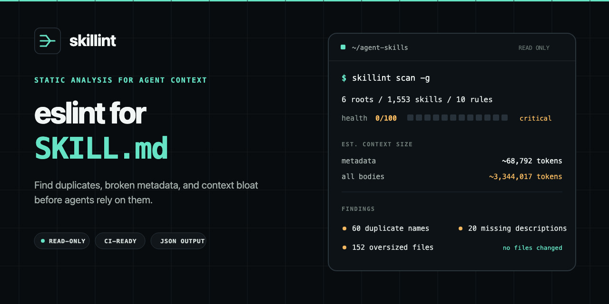
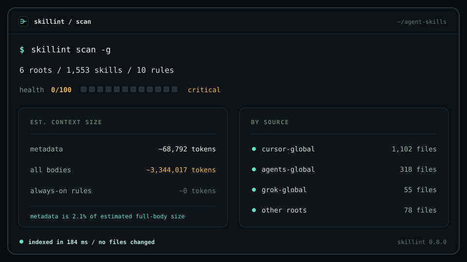

<p align="center">
  <a href="./README.md">English</a> ·
  <a href="./README.zh-CN.md">简体中文</a> ·
  <a href="./README.zh-TW.md">繁體中文</a> ·
  <a href="./README.ja.md">日本語</a> ·
  <a href="./README.ko.md">한국어</a> ·
  <a href="./README.es.md">Español</a> ·
  <a href="./README.fr.md">Français</a> ·
  <a href="./README.de.md">Deutsch</a> ·
  <a href="./README.pt-BR.md">Português</a> ·
  <a href="./README.ru.md">Русский</a>
</p>

<p align="center">
  
</p>

<h1 align="center">skillint</h1>

<p align="center"><b>给 <code>SKILL.md</code> 用的 eslint</b></p>

<p align="center">
  检查 Codex、Cursor、Claude Code、Grok、Gemini、Copilot 等工具使用的 <code>SKILL.md</code>、<code>AGENTS.md</code> 和编辑器规则。
  在它们进入提示词之前，找出重名、缺元数据、以及会撑爆上下文的文件。
</p>

<p align="center">
  <a href="https://github.com/iosrxwy/skillint/actions/workflows/ci.yml"></a>
  <a href="./LICENSE"></a>
  <a href="https://github.com/iosrxwy/skillint/stargazers"></a>
</p>

<p align="center">
  
</p>

---

## 为什么需要它

现在的编程 Agent 不再只读一份系统提示，而是按需加载 skill 目录。

这个目录只有在**短、有名字、有 description** 时才有效。如果本机复制了几百上千个 skill，常见后果是：

- 正式干活之前，光元数据就要吃掉成千上万 token
- 有用的 skill 被三份近重复本挡住
- 单次对话被 1 万 token 的正文打满
- 缺 `description` 时静默失败，skill 永远不会被选中

<p align="center">
  
</p>

`skillint` 就是给这个目录做静态检查。它不执行 skill，也不删除文件，只报告 Agent 将要负担的成本。

## 功能

- **盘点**：扫描 Codex / Cursor / Claude Code / Grok / Gemini / Copilot / 项目根目录中的 skills 与 rules
- **健康分**：0–100，根据 doctor 结果和目录规模打分
- **Token 预算**：估算元数据成本 vs 全文加载成本（`字符数 / 4`）
- **Doctor**：重名、缺/过短/第一人称 description、体积过大、过长的 AGENTS.md；同一 skill 装在 Cursor/Claude/Grok 里只记 info，不当错误
- **精简建议**：按优先级给出保留 / 拿掉列表，不改动磁盘
- **Markdown 报告**：适合放进 PR 和 CI 产物
- **GitHub Action**：`uses: iosrxwy/skillint@main`
- **JSON**：所有命令都支持 `--json`

## 安装

需要 Node.js 18.18+。

```bash
git clone https://github.com/iosrxwy/skillint.git
cd skillint
npm install
npx skillint scan
```

`npm install` 会编译 CLI。之后在仓库里可以直接 `npx skillint`，或 `npm link` 装到 PATH。

## 快速开始

```bash
skillint scan                 # 数量 + token + 健康条
skillint doctor               # 诊断
skillint init code-review     # 生成一份能直接通过 doctor 的 SKILL.md
skillint tokens               # 精简数字
skillint prune --keep 12      # 只给建议
skillint report --out out.md  # Markdown 报告
```

```bash
skillint scan -g              # 只扫用户级目录
skillint scan -p              # 只扫当前项目
skillint doctor ./skills
skillint doctor --json --fail-on error
skillint doctor --fail-under 80   # 健康分低于 80 时让 CI 失败
```

`prune` 和 `report` 都是只读的。skillint 不会删除任何 skill 文件。

## 真实扫描结果

在一台装了大量 skills 的开发机上：

<p align="center">
  
</p>

同一台机器跑 `doctor`：**233 个问题**（60 个重名、152 个过大、20 个缺 description）。

Agent 不需要三百万 token 的 skills。

## 扫描范围

| 工具 | 全局 | 项目 |
| --- | --- | --- |
| Cursor | `~/.cursor/skills`、`~/.cursor/rules` | `.cursor/skills`、`.cursor/rules` |
| Claude Code | `~/.claude/skills`、`~/.claude/rules` | `.claude/skills`、`.claude/rules` |
| Codex | `~/.codex/skills`、`~/.codex/rules`、`~/.codex/prompts` | `.codex/skills`、`.codex/rules`、`.codex/prompts` |
| Grok | `~/.grok/skills`、`~/.grok/plugins` | `.grok/skills`、`.grok/plugins` |
| Gemini / Antigravity | `~/.gemini/skills`、`~/.antigravity/skills` | `.gemini/skills`、`.antigravity/skills` |
| GitHub Copilot | `~/.copilot/skills` | `.github/skills`、`.github/agents`、`.github/instructions` |
| OpenCode | `~/.config/opencode/skills` | `.opencode/skills` |
| Windsurf | `~/.codeium/windsurf/skills`、`~/.windsurf/skills` | `.windsurf/skills` |
| Kiro | `~/.kiro/skills`、`~/.kiro/steering` | `.kiro/skills`、`.kiro/steering` |
| Cline / Continue | `~/.cline/skills`、`~/.continue/skills` | `.cline/skills`、`.continue/skills` |
| 通用 agents | `~/.agents/skills` | `.agents/skills`、`skills/` |
| 其他 | Factory、OpenClaw、Hermes、Qoder、CodeBuddy、Goose、Amp、Roo、Trae、Crush、Pi、cc-switch | 对应的 `.tool/skills` |

也会读取项目说明文件：`AGENTS.md`、`AGENT.md`、`CLAUDE.md`、`GEMINI.md`、`GROK.md`、`CODEX.md`、`COPILOT.md`、`WINDSURF.md`、`OPENCODE.md`、`.cursorrules`、`.windsurfrules`、`.clinerules`、`.github/copilot-instructions.md`。

Token 是估算值，用来比较体积，不是各家官方 tokenizer，不能用来对账。

## GitHub Action

```yaml
- uses: iosrxwy/skillint@main
  with:
    fail-on: error
```

问题会以 PR annotation 标出来。同一个 skill 装在 Cursor / Claude / Grok 里会记成 `synced-copy`（info），不会把 CI 打红。

忽略规则可写在 `.skillintignore`，或使用 `--ignore`。

## 配置文件

在运行目录放一份 `skillint.config.json`，团队可以共享忽略规则并调整 doctor 阈值：

```json
{
  "ignore": ["vendor", "*.bak"],
  "limits": {
    "skillBodyTokens": 3000,
    "descriptionMin": 60
  }
}
```

可调阈值：`skillBodyTokens`（4000）、`ruleAlwaysOnTokens`（800）、`descriptionMax`（1024）、`descriptionMin`（40）、`agentsDocLines`（100）、`nameMax`（64）。

## License

[MIT](./LICENSE) © 2026 [iosrxwy](https://github.com/iosrxwy)
