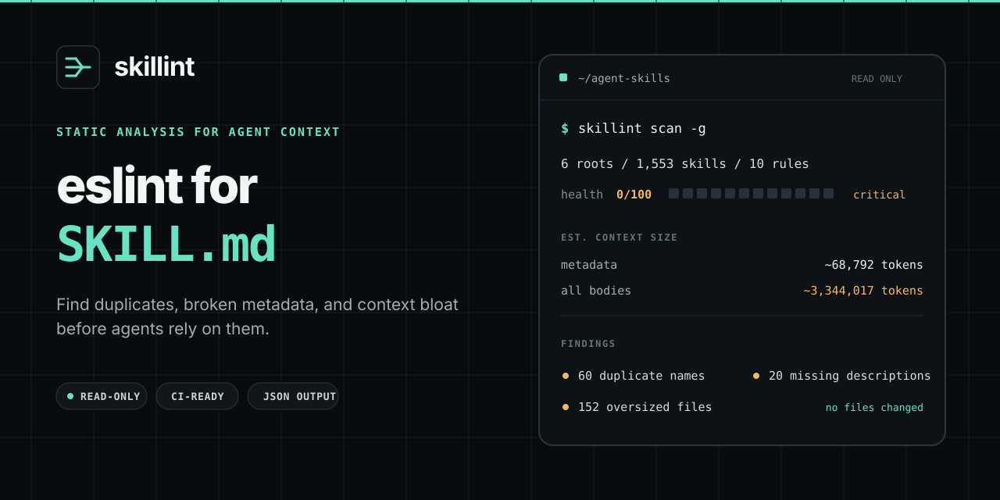
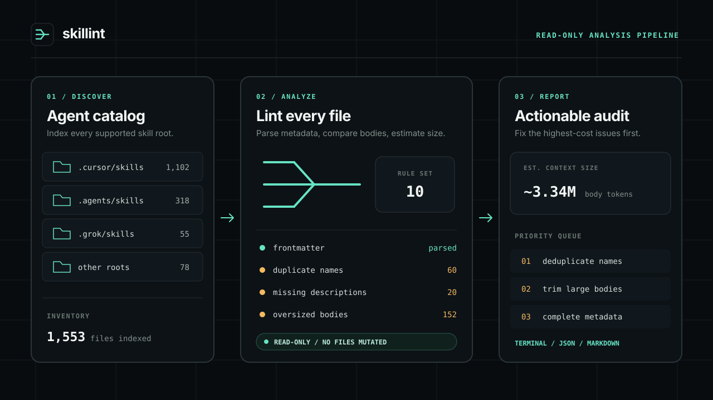

<p align="center">
  <a href="./README.md">English</a> ·
  <a href="./README.zh-CN.md">简体中文</a> ·
  <a href="./README.zh-TW.md">繁體中文</a> ·
  <a href="./README.ja.md">日本語</a> ·
  <a href="./README.ko.md">한국어</a> ·
  <a href="./README.es.md">Español</a> ·
  <a href="./README.fr.md">Français</a> ·
  <a href="./README.de.md">Deutsch</a> ·
  <a href="./README.pt-BR.md">Português</a> ·
  <a href="./README.ru.md">Русский</a>
</p>

<p align="center">
  
</p>

<h1 align="center">skillint</h1>

<p align="center"><b>给 <code>SKILL.md</code> 用的 eslint</b></p>

<p align="center">
  检查 Codex、Cursor、Claude Code、Grok、Gemini、Copilot 等工具使用的 <code>SKILL.md</code>、<code>AGENTS.md</code> 和编辑器规则。
  区分跨 Agent 同步副本与真实冲突，诊断损坏的元数据，并在它们成为 Agent 上下文前估算目录体量。
</p>

<p align="center">
  <a href="https://github.com/iosrxwy/skillint/actions/workflows/ci.yml"></a>
  <a href="https://www.npmjs.com/package/skillint"></a>
  <a href="./LICENSE"></a>
  <a href="https://github.com/iosrxwy/skillint/stargazers"></a>
</p>

<p align="center">
  
</p>

```bash
npx skillint
```

这会直接运行默认的本地扫描。审计链路是静态、只读的：skill 只会被当作文本解析，绝不会被执行。`scan`、`doctor`、`tokens`、`prune` 不修改目录；`report` 只写入你指定的报告文件。

## 它解决什么

- **目录失控**：统一盘点 Codex、Cursor、Claude Code、Grok、Gemini、Copilot、OpenCode、Windsurf、Kiro、Cline 等工具的全局与项目级 skills / rules
- **重复项噪声**：跨 Agent 安装记为 `synced-copy`（info），同一 Agent 系列内的重名才记为错误
- **Skill 规范损坏**：诊断缺失、未闭合或无效的 YAML frontmatter，以及必填字段、命名、正文过大、说明文件过长等问题
- **上下文体量不明**：用明确标注的估算值（`字符数 / 4`）比较元数据与正文；不冒充精确 tokenizer 成本，也不声称模型实际加载了哪些文件
- **CI 漂移**：输出 GitHub Action annotation 与 summary、Markdown/JSON 报告，并用 `--fail-on`、`--fail-under` 或共享配置阈值卡住回退
- **快速本地扫描**：并发、限量读取；识别符号链接并避免循环遍历；用 `skillint init` 生成合规起点

---

## 为什么需要它

编程 Agent 会从多个全局目录和项目目录发现说明文件。副本积累后，这个目录很快就难以判断：

- 同一 skill 装进多个 Agent 后，普通同步副本淹没真正的冲突
- 同一 Agent 系列内出现重名，选择会产生真实歧义
- frontmatter 损坏或字段缺失，skill 发现会变得不可靠
- 超大正文和 always-on rules 把潜在上下文成本藏了起来

<p align="center">
  
</p>

`skillint` 把这些目录整理成可执行的审计结果：清单、诊断、0–100 健康分、体量估算和精简建议，全程不删除文件。

## 安装

需要 Node.js 18.18+。

```bash
npx skillint scan
```

不用全局安装。希望一直使用 `skillint` 命令时：

```bash
npm install --global skillint
skillint scan
```

## 快速开始

```bash
npx skillint scan                 # 数量 + 体量估算 + 健康条
npx skillint doctor               # 诊断
npx skillint init code-review     # 生成一份能直接通过 doctor 的 SKILL.md
npx skillint tokens               # 精简估算
npx skillint prune --keep 12      # 只给建议
npx skillint report --out out.md  # Markdown 报告
```

```bash
npx skillint scan -g              # 只扫用户级目录
npx skillint scan -p              # 只扫当前项目
npx skillint doctor ./skills
npx skillint doctor --json --fail-on error
npx skillint doctor --fail-under 80   # 健康分低于 80 时让 CI 失败
```

审计命令不会修改或删除被扫描的 skill。`report` 只创建指定的报告，`init` 也绝不会覆盖已有的 `SKILL.md`。

## 真实扫描结果

在一台装了大量 skills 的开发机上：

<p align="center">
  
</p>

同一台机器跑 `doctor`：**233 个问题**（60 个重名、152 个过大、20 个缺 description）。

约 334 万 token 是对已发现文件的体量估算，不代表任何 Agent 会把整个目录全部加载。

## 扫描范围

| 工具 | 全局 | 项目 |
| --- | --- | --- |
| Cursor | `~/.cursor/skills`、`~/.cursor/rules` | `.cursor/skills`、`.cursor/rules` |
| Claude Code | `~/.claude/skills`、`~/.claude/rules` | `.claude/skills`、`.claude/rules` |
| Codex | `~/.codex/skills`、`~/.codex/rules`、`~/.codex/prompts` | `.codex/skills`、`.codex/rules`、`.codex/prompts` |
| Grok | `~/.grok/skills`、`~/.grok/plugins` | `.grok/skills`、`.grok/plugins` |
| Gemini / Antigravity | `~/.gemini/skills`、`~/.antigravity/skills` | `.gemini/skills`、`.antigravity/skills` |
| GitHub Copilot | `~/.copilot/skills` | `.github/skills`、`.github/agents`、`.github/instructions` |
| OpenCode | `~/.config/opencode/skills` | `.opencode/skills` |
| Windsurf | `~/.codeium/windsurf/skills`、`~/.windsurf/skills` | `.windsurf/skills` |
| Kiro | `~/.kiro/skills`、`~/.kiro/steering` | `.kiro/skills`、`.kiro/steering` |
| Cline / Continue | `~/.cline/skills`、`~/.continue/skills` | `.cline/skills`、`.continue/skills` |
| 通用 agents | `~/.agents/skills` | `.agents/skills`、`skills/` |
| 其他 | Factory、OpenClaw、Hermes、Qoder、CodeBuddy、Goose、Amp、Roo、Trae、Crush、Pi、cc-switch | 对应的 `.tool/skills` |

也会读取项目说明文件：`AGENTS.md`、`AGENT.md`、`CLAUDE.md`、`GEMINI.md`、`GROK.md`、`CODEX.md`、`COPILOT.md`、`WINDSURF.md`、`OPENCODE.md`、`.cursorrules`、`.windsurfrules`、`.clinerules`、`.github/copilot-instructions.md`。

Token 是估算值，用来比较体积，不是各家官方 tokenizer，不能用来对账。

## GitHub Action

```yaml
- uses: iosrxwy/skillint@main
  with:
    fail-on: error
```

问题会以 PR annotation 标出来。同一个 skill 装在 Cursor / Claude / Grok 里会记成 `synced-copy`（info），不会把 CI 打红。

忽略规则可写在 `.skillintignore`，或使用 `--ignore`。

## 配置文件

在运行目录放一份 `skillint.config.json`，团队可以共享忽略规则并调整 doctor 阈值：

```json
{
  "$schema": "https://unpkg.com/skillint@latest/skillint.schema.json",
  "ignore": ["vendor", "*.bak"],
  "limits": {
    "skillBodyTokens": 3000,
    "descriptionMin": 60
  }
}
```

Schema 会提供编辑器自动补全，并抓出拼错的设置。可调阈值：`skillBodyTokens`（4000）、`ruleAlwaysOnTokens`（800）、`descriptionMax`（1024）、`descriptionMin`（40）、`agentsDocLines`（100）、`nameMax`（64）。

## License

[MIT](./LICENSE) © 2026 [iosrxwy](https://github.com/iosrxwy)
