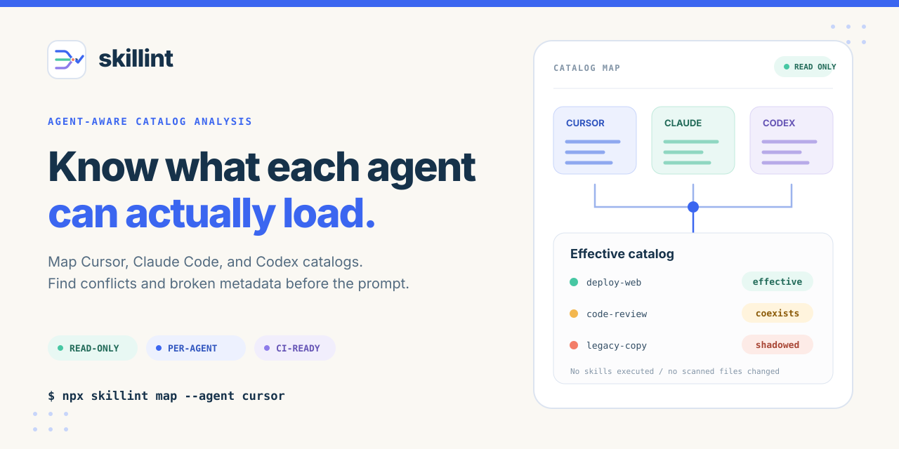
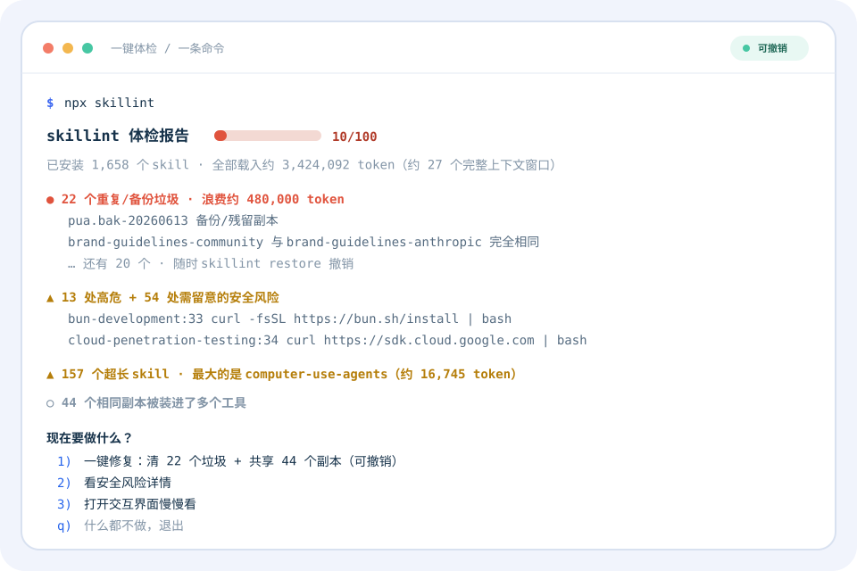
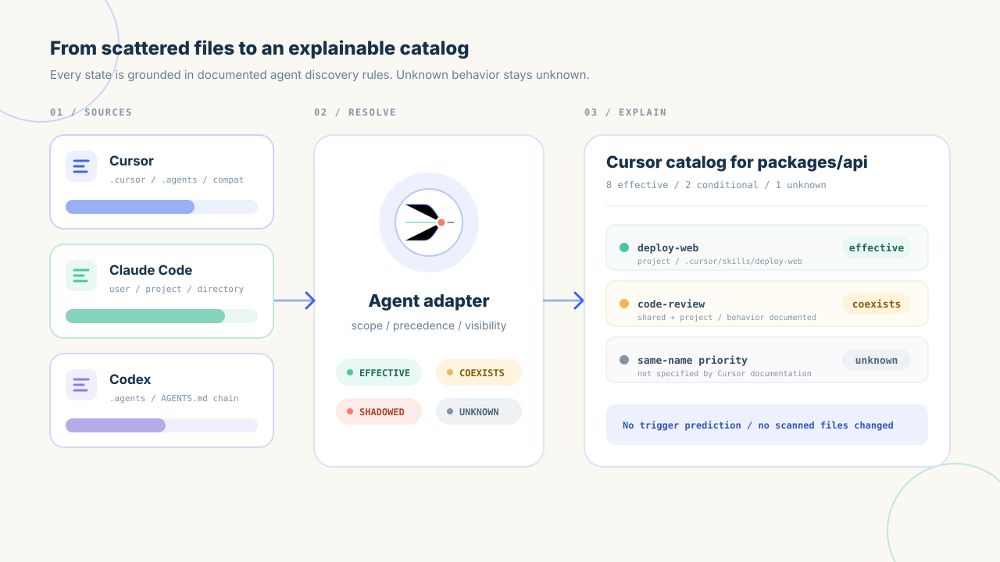
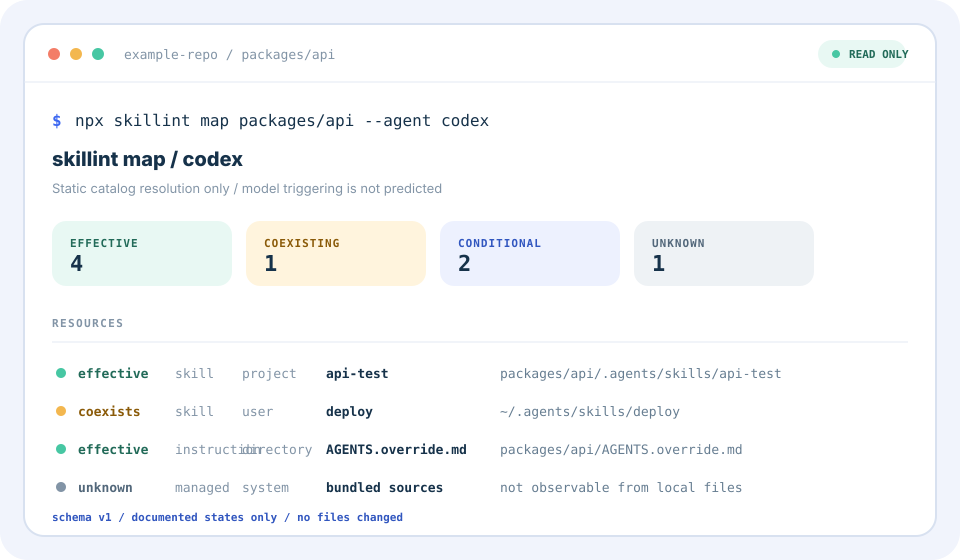
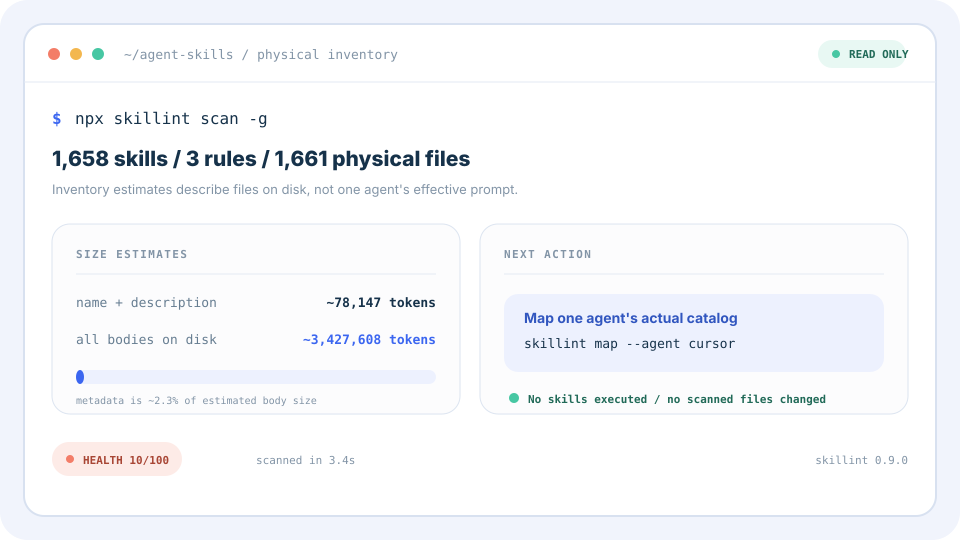

<p align="center">
  <a href="./README.md">English</a> ·
  <a href="./README.zh-CN.md">简体中文</a> ·
  <a href="./README.zh-TW.md">繁體中文</a> ·
  <a href="./README.ja.md">日本語</a> ·
  <a href="./README.ko.md">한국어</a> ·
  <a href="./README.es.md">Español</a> ·
  <a href="./README.fr.md">Français</a> ·
  <a href="./README.de.md">Deutsch</a> ·
  <a href="./README.pt-BR.md">Português</a> ·
  <a href="./README.ru.md">Русский</a>
</p>

<p align="center">
  
</p>

<h1 align="center">skillint</h1>

<p align="center"><b>给 <code>SKILL.md</code> 用的 eslint</b></p>

<p align="center">
  检查 Codex、Cursor、Claude Code、Grok、Gemini、Copilot 等工具使用的 <code>SKILL.md</code>、<code>AGENTS.md</code> 和编辑器规则。
  区分跨 Agent 同步副本与真实冲突，诊断损坏的元数据，并在它们成为 Agent 上下文前估算目录体量。
</p>

<p align="center">
  <a href="https://github.com/iosrxwy/skillint/actions/workflows/ci.yml"></a>
  <a href="https://www.npmjs.com/package/skillint"></a>
  <a href="./LICENSE"></a>
  <a href="https://github.com/iosrxwy/skillint/stargazers"></a>
</p>

<p align="center">
  
</p>

```bash
npx skillint
```

在终端里这一条命令就是「一键体检」：自动扫描所有 Agent 的 skills，用大白话（中文环境显示中文）告诉你有什么问题，然后给出编号选项——清进回收站、看安全风险、共享重复副本、或打开交互界面。所有写操作都能用 `skillint restore` 撤销。在 CI 或管道里（无终端交互）则输出经典的清单报告。

<p align="center">
  
</p>

审计链路默认是静态、只读的：skill 只会被当作文本解析，绝不会被执行。`scan`、`map`、`doctor`、`audit`、`tokens` 不修改目录；`prune --apply`、`trash`、`link --apply`、`update --apply` 是显式且可撤销的写操作。

## 它解决什么

- **目录失控**：统一盘点 Codex、Cursor、Claude Code、Grok、Gemini、Copilot、OpenCode、Windsurf、Kiro、Cline 等工具的全局与项目级 skills / rules
- **按 Agent 解析**：按照 Cursor、Claude Code、Codex 各自的官方发现语义，把资源标为 effective、coexisting、shadowed、conditional 或 unknown
- **重复项噪声**：跨 Agent 安装记为 `synced-copy`（info），同一 Agent 系列内的重名才记为错误
- **Skill 规范损坏**：诊断缺失、未闭合或无效的 YAML frontmatter，以及必填字段、命名、正文过大、说明文件过长等问题
- **Skill 供应链**：审计已装 skill 里的 `curl | bash`、泄露 token、提示词注入话术、权限绕过参数和破坏性命令，结果带 路径:行号
- **上下文体量不明**：用明确标注的估算值（`字符数 / 4`）比较元数据与正文；不冒充精确 tokenizer 成本，也不声称模型实际加载了哪些文件
- **CI 漂移**：输出 GitHub Action annotation 与 summary、Markdown/JSON 报告，并用 `--fail-on`、`--fail-under` 或共享配置阈值卡住回退
- **快速本地扫描**：并发、限量读取；识别符号链接并避免循环遍历；用 `skillint init` 生成合规起点

---

## 为什么需要它

编程 Agent 会从多个全局目录和项目目录发现说明文件。副本积累后，这个目录很快就难以判断：

- 同一 skill 装进多个 Agent 后，普通同步副本淹没真正的冲突
- 同一 Agent 系列内出现重名，选择会产生真实歧义
- frontmatter 损坏或字段缺失，skill 发现会变得不可靠
- 超大正文和 always-on rules 把潜在上下文成本藏了起来

<p align="center">
  
</p>

`skillint` 把这些目录整理成可执行的审计结果：清单、诊断、0–100 健康分、体量估算，以及**可一键撤销**的清理计划。它从不删文件——清理即隔离，`skillint restore` 随时反悔。

## 安装

需要 Node.js 22.12+。

```bash
npx skillint scan
```

不用全局安装。希望一直使用 `skillint` 命令时：

```bash
npm install --global skillint
skillint scan
```

## 快速开始

```bash
npx skillint scan                 # 数量 + 体量估算 + 健康条
npx skillint map --agent cursor   # 当前目录对应的 Cursor 目录
npx skillint doctor               # 诊断
npx skillint audit                # 安全扫描：curl|bash、泄露密钥、提示词注入
npx skillint ui                   # 交互式终端界面，覆盖全部功能
npx skillint init code-review     # 生成一份能直接通过 doctor 的 SKILL.md
npx skillint tokens               # 精简估算
npx skillint prune                # 清理计划（安全项进可撤销的隔离区）
npx skillint prune --apply        # 把全部安全项移入 ~/.skillint/trash
npx skillint restore              # 一键撤销上一批
npx skillint fix --apply          # 复活元数据损坏的 skill
npx skillint adopt                # 孤儿 skill 认领来源
npx skillint update --apply       # 批量更新 git + 已认领的 skill
npx skillint report --html        # 单文件 HTML 仪表盘
npx skillint badge                # README 用的健康分徽章

npx skillint link                 # 跨 Agent 共享同一份 skill
npx skillint update               # 检查有 git 远程的 skill 能否更新
npx skillint report --out out.md  # Markdown 报告
```

```bash
npx skillint scan -g              # 只扫用户级目录
npx skillint scan -p              # 只扫当前项目
npx skillint doctor ./skills
npx skillint doctor --json --fail-on error
npx skillint doctor --fail-under 80   # 健康分低于 80 时让 CI 失败
```

审计命令不会修改或删除被扫描的 skill。`report` 只创建指定的报告，`init` 也绝不会覆盖已有的 `SKILL.md`。`prune --apply`、`trash`、`restore`、`link --apply`、`update --apply` 是需要显式执行的写操作。

## 清理 —— 永远不用 `rm`

skillint 从不删除任何东西。清理是把条目**移进隔离区** `~/.skillint/trash/<时间戳>/`（带清单文件），`skillint restore` 可以把上一批原路移回：

```bash
npx skillint prune -g            # 看计划：哪些该清、为什么
npx skillint prune -g --apply    # 把全部安全项移入隔离区
npx skillint restore             # 后悔了？一键撤销
npx skillint trash <路径...>     # 手动隔离指定条目
```

| 档位 | 含义 |
| --- | --- |
| **safe** | 备份、嵌套副本、同一目录内重名。`--apply` 会移入隔离区。 |
| **review** | 体积过大或元数据损坏。先裁剪或修复；`--apply` 绝不碰它们。 |

`prune` 只处理**同一个目录里的垃圾**。Cursor、Claude、Codex、Grok 各自装的同一份 skill 不会被动——每个 Agent 只读自己的目录，跨 Agent 用 `skillint link` 共享。

## 交互式界面

`skillint ui` 把整个引擎装进 lazygit 风格的终端界面，不用记参数：

```bash
npx skillint ui -g
```

五个标签页带实时计数：**issues**（诊断）、**audit**（安全扫描）、**cleanup**（清理计划）、**links**（跨 Agent 共享）、**largest**（token 大户）。`1-5` 切换、`j`/`k` 移动、`c` 复制选中行的建议命令、`r` 重新扫描、`q` 退出。界面只读、零额外依赖——命令只复制到剪贴板，绝不代替你执行。

## 装之前先扫一眼仓库

Skill 是 Agent 会照做的指令。`npx skills add` 之前先查一下这个仓库干不干净：

```bash
npx skillint scan-remote owner/repo
```

浅克隆到缓存、静态扫描每个 `SKILL.md`（外加 shell 脚本和说明文件），给出结论——`clean` / `caution` / `risky`——每条都带 文件:行号。risky 时退出码为 1，可以直接卡 CI。仓库内容绝不会被执行。

[`OBSERVATORY.md`](./OBSERVATORY.md) 用这个扫描器持续追踪热门公开 skill 仓库，GitHub Actions 每周自动刷新。

## 让 Agent 直接调用（MCP）

`skillint mcp` 是零依赖的 MCP 服务器（stdio）。配置之后，Claude Code / Cursor 里说一句「审计我的 skills」，Agent 就会原生调用 skillint 拿到结构化结果，而不是现场编 grep：

```json
{
  "mcpServers": {
    "skillint": { "command": "npx", "args": ["-y", "skillint", "mcp"] }
  }
}
```

暴露的工具：`skill_checkup`（体检）、`skill_audit`（安全审计）、`skill_cleanup_plan`（清理计划）、`scan_skill_repo`（装前查仓库）。全部只读；清理只返回命令，由人来执行。

## 安全审计

Skill 是你从网上装来的 markdown，而 Agent 会照着执行。`audit` 在 Agent 执行之前，静态扫描每一份已装 skill 里的危险模式：

```bash
npx skillint audit -g
npx skillint audit --fail-on error   # 在 CI 里卡门禁
```

| 规则 | 检出内容 |
| --- | --- |
| `remote-exec` | `curl \| bash`、`irm \| iex` 安装管道 |
| `credential` | AWS/GitHub/Stripe/Slack/OpenAI token 格式、私钥块 |
| `prompt-injection` | “忽略之前的指令”“不要告诉用户”这类话术 |
| `exfiltration` | 要求把密钥或环境变量发送到某个 URL |
| `permission-bypass` | `--dangerously-skip-permissions`、`--yolo`、`--no-sandbox` |
| `sensitive-file` | `~/.ssh`、`.aws/credentials`、keychain 读取 |
| `destructive` | `rm -rf ~`、fork 炸弹 |

文档占位符（`sk-xxxx…`、`AKIA…EXAMPLE`）会被过滤。每条结果带 `路径:行号` 和命中片段；在 GitHub Actions 里会显示为行级注解。扫描是静态只读的，不执行任何内容。

## Skill 管理器

跨 Agent 的相同副本应该**共享**，而不是互删：

```bash
npx skillint link -g              # 先看计划
npx skillint link -g --apply      # 把相同副本换成指向正本的符号链接
npx skillint adopt -g             # 用内容指纹给孤儿 skill 认领来源
npx skillint update -g            # 检查 git 仓库 + 已认领的 skill
npx skillint update -g --apply    # 批量更新所有落后的
```

`adopt` 解决「市场拷来的 skill 没有上游、谁都更新不了」的问题：给每个已装 skill 算内容指纹，和知名公共仓库（Anthropic skills、Vercel agent-skills、superpowers，`--repo` 可加）比对，命中就记录来源。之后 `skillint update` 就能批量检查、`--apply` 批量更新——旧版本先进隔离区，`skillint restore` 照样能反悔。只有同名但内容不同的会列为「候选」，绝不自动更新。

## 修复损坏的 skill

有些装好的 skill 对 Agent 完全隐形——常常只是因为 `---` 后面多了个空格：

```bash
npx skillint fix                  # 先看会恢复出什么
npx skillint fix --apply          # 写入；原文件先进隔离区
```

`fix` 能恢复没写 `---` 包裹的裸 frontmatter、归一化带尾随空格的分隔符、从文件夹名和正文起草缺失的 name/description。扫描引擎本身也已容错——仅这一项就让这台机器上 8 个「死 skill」复活，健康分从 10 涨到 42。

## 毒舌模式

```bash
npx skillint roast --card
```

> 你装了 1,658 个 skill。你的 Agent 不缺技能，缺的是注意力。
> 全部载入需要约 27 个完整上下文窗口。这不是技能库，这是给 Agent 准备的鹤岗房贷。
> 67 个 skill 里藏着「下载并执行网上脚本」之类的操作。给陌生 markdown 开 shell 权限，勇气可嘉。

只读、中英双语，`--card` 会生成一张可分享的战绩卡。欢迎晒图。

## HTML 仪表盘和徽章

```bash
npx skillint report --html        # 生成单文件 skillint-report.html，零依赖
npx skillint badge                # 生成 skills-health.svg + 可直接粘贴的引用
```

仪表盘带健康分仪表、按来源的条形图、可筛选的诊断/安全/清理表格——可以直接发给同事或贴到 PR 里。徽章是 shields 风格、按分数变色，适合放 README 和 dotfiles 仓库。

## Agent 感知的目录映射

`scan` 是覆盖多种工具的物理文件清单。它的 token 总量只描述磁盘上发现的文件，不代表某个 Agent 的有效目录，也不声称模型加载了全部文件。

`map` 会针对一个工作目录应用指定 Agent 的适配器：

```bash
npx skillint map [cwd] --agent cursor
npx skillint map [cwd] --agent claude
npx skillint map [cwd] --agent codex
npx skillint map . --agent codex --json
```

<p align="center">
  
</p>

JSON 输出包含 `schemaVersion: 1`，并提供逻辑路径、真实路径、作用域、资源角色、来源类型、官方文档 URL、可见性和解析方式。

- `effective`：静态上属于当前说明链，或无条件加载
- `coexisting`：官方语义明确让同名资源作为独立条目共存
- `shadowed`：官方优先级规则明确选择了另一个已观察到的资源
- `conditional`：是否可用取决于目录/文件上下文、glob、手动调用或 Agent 的相关性判断
- `unknown`：行为未被官方说明、来源由外部托管，或依赖 `skillint` 未解析的信任/配置状态

`map` 不预测模型是否会触发某个 skill。Cursor 的同名 skill 优先级会标为 unknown，而不是猜测；Claude 的个人/项目优先级和目录限定 skill 会按官方语义处理；Codex 的同名 skills 共存，`AGENTS.override.md` 只会在同一目录层级盖过 `AGENTS.md`。托管与内置来源只作为限制说明，不会伪造成本地文件。

适配器语义来自当前官方文档：[Cursor skills](https://cursor.com/docs/skills) 与 [rules](https://cursor.com/docs/rules)、[Claude Code skills](https://code.claude.com/docs/en/skills) 与 [memory](https://code.claude.com/docs/en/memory)，以及 [Codex skills](https://developers.openai.com/codex/skills) 与 [`AGENTS.md`](https://developers.openai.com/codex/guides/agents-md)。

## 真实扫描结果

在一台装了大量 skills 的开发机上：

<p align="center">
  
</p>

同一台机器跑 `doctor`：**271 个结果**，其中包括 157 个正文过大、13 个同系列重名，以及 54 个仅作为提示而非错误的跨 Agent 同步副本。

约 343 万 token 是对已发现文件的体量估算，不代表任何 Agent 会把整个目录全部加载。

## `scan` 的物理清单范围

这些目录用于跨 Agent 的磁盘清单审计，其中包含兼容与旧版位置。需要查看某个 Agent 当前的有效目录语义时，请使用 `map`。

| 工具 | 全局 | 项目 |
| --- | --- | --- |
| Cursor | `~/.cursor/skills`、`~/.cursor/rules` | `.cursor/skills`、`.cursor/rules` |
| Claude Code | `~/.claude/skills`、`~/.claude/rules` | `.claude/skills`、`.claude/rules` |
| Codex | `~/.codex/skills`、`~/.codex/rules`、`~/.codex/prompts` | `.codex/skills`、`.codex/rules`、`.codex/prompts` |
| Grok | `~/.grok/skills`、`~/.grok/plugins` | `.grok/skills`、`.grok/plugins` |
| Gemini / Antigravity | `~/.gemini/skills`、`~/.antigravity/skills` | `.gemini/skills`、`.antigravity/skills` |
| GitHub Copilot | `~/.copilot/skills` | `.github/skills`、`.github/agents`、`.github/instructions` |
| OpenCode | `~/.config/opencode/skills` | `.opencode/skills` |
| Windsurf | `~/.codeium/windsurf/skills`、`~/.windsurf/skills` | `.windsurf/skills` |
| Kiro | `~/.kiro/skills`、`~/.kiro/steering` | `.kiro/skills`、`.kiro/steering` |
| Cline / Continue | `~/.cline/skills`、`~/.continue/skills` | `.cline/skills`、`.continue/skills` |
| 通用 agents | `~/.agents/skills` | `.agents/skills`、`skills/` |
| 其他 | Factory、OpenClaw、Hermes、Qoder、CodeBuddy、Goose、Amp、Roo、Trae、Crush、Pi、cc-switch | 对应的 `.tool/skills` |

也会读取项目说明文件：`AGENTS.md`、`AGENT.md`、`CLAUDE.md`、`GEMINI.md`、`GROK.md`、`CODEX.md`、`COPILOT.md`、`WINDSURF.md`、`OPENCODE.md`、`.cursorrules`、`.windsurfrules`、`.clinerules`、`.github/copilot-instructions.md`。

Token 是**物理清单估算值**，用来比较体积；它既不是各家官方 tokenizer，也不代表模型上下文，不能用来对账。

## GitHub Action

```yaml
- uses: iosrxwy/skillint@main
  with:
    fail-on: error
```

问题会以 PR annotation 标出来。同一个 skill 装在 Cursor / Claude / Grok 里会记成 `synced-copy`（info），不会把 CI 打红。

忽略规则可写在 `.skillintignore`，或使用 `--ignore`。

## 配置文件

在运行目录放一份 `skillint.config.json`，团队可以共享忽略规则并调整 doctor 阈值：

```json
{
  "$schema": "https://unpkg.com/skillint@latest/skillint.schema.json",
  "ignore": ["vendor", "*.bak"],
  "limits": {
    "skillBodyTokens": 3000,
    "descriptionMin": 60
  }
}
```

Schema 会提供编辑器自动补全，并抓出拼错的设置。可调阈值：`skillBodyTokens`（4000）、`ruleAlwaysOnTokens`（800）、`descriptionMax`（1024）、`descriptionMin`（40）、`agentsDocLines`（100）、`nameMax`（64）。

## Star

如果 skillint 让你看到了自己机器上不知道的事，[点个 star](https://github.com/iosrxwy/skillint) 是对项目最大的支持。

## License

[MIT](./LICENSE) © 2026 [iosrxwy](https://github.com/iosrxwy)
